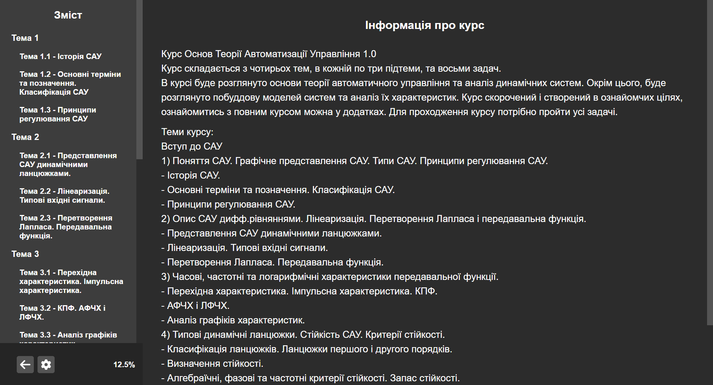
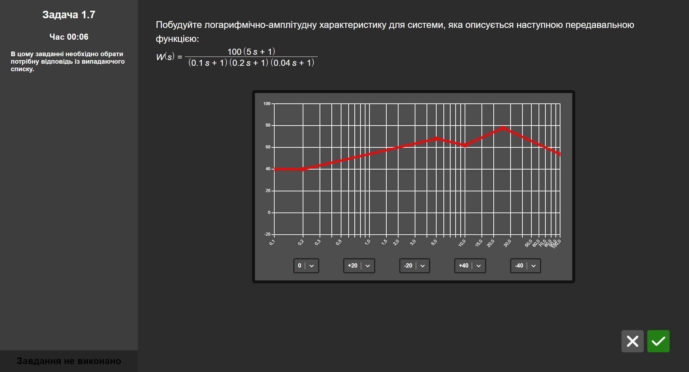

 

  

<h3 align="center">SCET</h3>

System Control Engineering Trainer
 
Version 1.0 
 
 
<a href="https://github.com/VektorDio/SCET">Explore the docs</a>
.
<a href="https://github.com/VektorDio/SCET/issues">Report Bug</a>
.
<a href="https://github.com/VektorDio/SCET/issues">Request Feature</a>

  

## Table Of Contents

- [Table Of Contents](#table-of-contents)
- [About The Project](#about-the-project)
- [Built With](#built-with)
- [Getting Started](#getting-started)
    - [Prerequisites](#prerequisites)
- [License](#license)
- [Authors](#authors)

## About The Project

This is a standalone desktop application, that allows you to complete a custom course in system control engineering.
Course includes some theoretical material and eight practical tasks. 
All course content is in Ukrainian language. 

This was part of a diploma project.

## Built With

- [JavaScript](https://www.javascript.com/)
- [React](https://react.dev/)
- [Electron](https://www.electronjs.org/)

## Getting Started

Download installer from release and use it, or just use unpacked version (launch from .exe file)

### Prerequisites

No prerequisites

## License

Distributed under the MIT License. See [LICENSE](https://github.com/VektorDio/SCET/blob/master/LICENSE) for more information.

## Authors

- **Daniel R** - _Computer Science Student_ - [VektorDio](https://github.com/VektorDio/) - _All Work_
